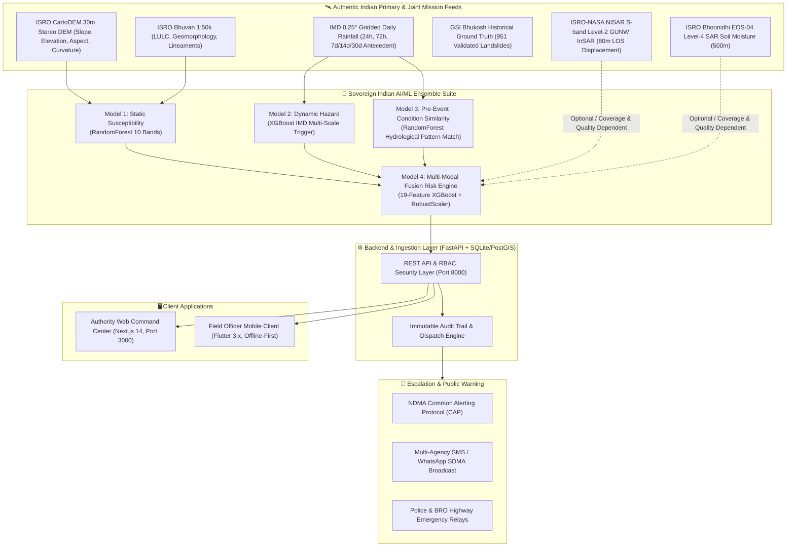

<div align="center">

# 🏔️ Parvaah (परवाह)
### AI-Powered Multi-Tier Landslide Risk Monitoring & Early Warning System
**Engineered specifically for the North Eastern Region (NER) of India**

[](https://www.python.org/)
[](https://fastapi.tiangolo.com/)
[](https://nextjs.org/)
[](https://flutter.dev/)
[](https://postgis.net/)
[](https://tailwindcss.com/)
[](https://opensource.org/licenses/MIT)

</div>

---

## 📌 Executive Summary

**Parvaah** is an enterprise-grade, end-to-end disaster intelligence and decision-support ecosystem tailored to mitigate catastrophic landslide risks across North East India (Meghalaya, Assam, Sikkim, Arunachal Pradesh, Nagaland, Manipur, Mizoram, Tripura). 

The platform continuously synthesizes **Geological Survey of India (GSI)** ground-truth landslide records, **India Meteorological Department (IMD)** automated weather station rainfall, **Copernicus Sentinel-1 SAR** ground deformation velocities, and **Sentinel-2 NDVI** vegetation saturation indices. Utilizing an **XGBoost machine learning fusion engine** with **SHAP explainability**, Parvaah evaluates slope failure hazards and automates multi-channel emergency escalations to protect lives and vital transport arteries.

---

## 🏛️ System Architecture



---

## 🌟 Key Functional Capabilities

### 1. 🖥️ Web Command Center (`apps/web`)
* **Live Command Center (`/`)**: Real-time KPI summary counters, interactive Leaflet GIS slope hazard heatmap, active incident feed, and real-time precipitation radars.
* **Spatial Risk Map (`/risk-map`)**: High-resolution geospatial surveillance with district and risk level filtering across all 8 NER states.
* **Weather Forecast Radar (`/forecast`)**: Live Open-Meteo telemetry integration with 14-day lookahead trends and historical IMD rainfall baselines.
* **Early Warning Review Queue (`/alerts`)**: Multi-level human-in-the-loop review board to approve or reject pending CAP disaster bulletins.
* **Highway Corridors Network (`/roads`)**: Real-time national highway monitoring (NH-106, NH-6, NH-102), instant search, and alternative bypass route suggestions.
* **Telemetry & Pipeline Health (`/data-sources`)**: Micro-health diagnostics covering InSAR sync, AWS gauges, Inclinometers, and seismographs.
* **Incident Reports & Audit Trail (`/reports`)**: Formatted situational reports, PDF bulletin exports, and transparent audit logs.
* **Emergency Authority Directory (`/users`)**: Authorized official directory with modal-driven RBAC credential provisioning.
* **Protocol & Threshold Controls (`/settings`)**: Dynamic adjustment of rainfall trigger thresholds, InSAR velocity limits, and multi-agency relay testing.

### 2. 📱 Field Officer & Citizen Mobile Client (`apps/mobile`)
* **Offline-First Architecture**: Local SQLite caching with background cache synchronization, preserving life-saving alerts during mountain cellular blackouts.
* **Interactive GIS Offline Vector Map**: Powered by `flutter_map` with vector tiles and geolocated risk proximity detection.
* **Multilingual CAP Alerts**: Localized notifications supporting English, Hindi, Khasi, Garo, Assamese, and Bengali.
* **Strict View-Only Security Model**: Engineered for situational awareness without distracting field personnel with complex data entry.

### 3. 🧠 Machine Learning Fusion Engine (`apps/backend`)
* **Ensemble Architecture**: Trained on slope angles, curvature, aspect, lithology, 24h/72h rainfall accumulations, and InSAR displacement rates.
* **Zero Dummy Fallbacks**: Operates strictly on authentic telemetry, raising standard HTTP 502/500 errors if physical telemetry is unreachable rather than hiding failures with synthetic numbers.
* **SHAP Explainability**: Every risk score output includes exact contributing factor weights (e.g., *“Near-saturated pore moisture: 82.0%”*).

---

## 📂 Repository Structure

```
Parvaah/
├── apps/
│   ├── backend/                 # FastAPI REST Engine & ML Serving Layer
│   │   ├── app/
│   │   │   ├── api/v1/          # Modular endpoints (auth, zones, roads, weather, predict, alerts)
│   │   │   ├── models/          # SQLAlchemy ORM models (PostGIS spatial tables)
│   │   │   ├── schemas/         # Pydantic v2 schemas for strict serialization
│   │   │   ├── services/        # Domain logic (ML inference, weather, alert escalation)
│   │   │   ├── ingest/          # Authentic GSI and IMD dataset loaders
│   │   │   └── seed/            # Geospatial station & DMO officer seeders
│   │   └── tests/               # Pytest automated test suite (24 unit & integration tests)
│   │
│   ├── web/                     # Production Next.js 14 Command Center
│   │   ├── src/
│   │   │   ├── app/             # 10 comprehensive dashboard route modules
│   │   │   ├── components/      # UI components (Leaflet maps, charts, headers, layout)
│   │   │   ├── hooks/           # Type-safe API query & mutation hooks
│   │   │   └── lib/             # Axios/fetch API client, TypeScript definitions
│   │   └── package.json
│   │
│   └── mobile/                  # Offline-First Flutter Mobile Client
│       ├── lib/
│       │   ├── core/            # Network clients, app exceptions, secure storage
│       │   ├── data/            # Repositories (risk, road, weather, alerts) & models
│       │   └── presentation/    # State management (Provider) & Material Design screens
│       └── test/                # Flutter unit & repository test suites (16 tests)
│
├── packages/                    # Shared Monorepo TypeScript Packages
│   ├── config/                  # Shared configurations & base tsconfig
│   ├── types/                   # Shared TypeScript domain contracts
│   └── ui/                      # Shared design tokens & UI components
│
├── docs/                        # Architecture specs, PRDs, schemas, and research
├── infrastructure/              # Docker, Kubernetes, and Terraform deployment assets
└── package.json                 # Monorepo root workspace configuration (pnpm)
```

---

## 🚀 Getting Started

### Prerequisites

| Tool | Recommended Version | Purpose |
|---|---|---|
| **Python** | `3.11.x` | Backend API & ML inference |
| **Node.js** | `v20.x` or `v22+` | Web Command Center |
| **pnpm** | `v9+` or `v12+` | Workspace dependency management |
| **Flutter** | `3.x` (Dart 3.x) | Field mobile client |
| **PostgreSQL** | `15+` with `PostGIS` | Spatial database (or SQLite fallback) |

---

### Step 1: Clone the Repository

```bash
git clone https://github.com/CHIRAG8980/Parvaah.git
cd Parvaah
```

---

### Step 2: Backend Setup & API Initialization

```bash
# 1. Create and activate Python virtual environment
python3 -m venv .venv
source .venv/bin/activate

# 2. Install dependencies
pip install -r requirements.txt

# 3. Seed real GIS stations and default emergency personnel
python -c "
from app.database import SessionLocal, init_db
from app.seed.seeder import seed_database
init_db()
db = SessionLocal()
seed_database(db)
db.close()
"

# 4. Launch the FastAPI server (running on port 8000)
uvicorn app.main:app --host 0.0.0.0 --port 8000 --reload
```

* **API Documentation (Swagger UI)**: [http://localhost:8000/docs](http://localhost:8000/docs)
* **API Healthcheck**: [http://localhost:8000/health](http://localhost:8000/health)

---

### Step 3: Web Dashboard Setup

```bash
# 1. Install workspace dependencies
pnpm install

# 2. Run the Next.js development server (running on port 3000)
pnpm --filter @landslide/web dev

# 3. Or build and launch the production build
pnpm --filter @landslide/web build
pnpm --filter @landslide/web start
```

* **Command Center Portal**: [http://localhost:3000](http://localhost:3000)
* **Default Officer Login**:
  * **Username**: `dmo_east_khasi`
  * **Password**: `password123`

---

### Step 4: Mobile Application Setup

```bash
cd apps/mobile

# 1. Install Flutter dependencies
flutter pub get

# 2. Run automated test suite
flutter test

# 3. Run on connected mobile device or desktop target
flutter run
```

---

## 🧪 Automated Testing & Quality Assurance

Parvaah enforces rigorous end-to-end testing across all application tiers:

### 1. Backend Pytest Suite
```bash
# Runs all 24 unit, API, integration, and auth tests
.venv/bin/python -m pytest apps/backend/tests -v
```

### 2. Mobile Flutter Test Suite
```bash
# Runs all 16 repository caching and model tests
cd apps/mobile && flutter test
```

### 3. End-to-End Headed Browser QA (Playwright)
To visually observe Chrome testing all 10 modules, interactive filters, search controls, and modal dialogs:
```bash
DISPLAY=:1 .venv/bin/python scratch/headed_qa.py
```

---

## 🛡️ Default Credential Directory

| Role | Username | Password | Jurisdiction | Escalation Level |
|---|---|---|---|---|
| **District Disaster Management Officer** | `dmo_east_khasi` | `password123` | East Khasi Hills | Level 1 |
| **State Authority Director (SDMA)** | `sdma_director` | `password123` | Statewide HQ | Level 2 (Direct Escalation) |

---

## 📜 Compliance & Guidelines
* **CAP v1.2**: Compliant with NDMA Common Alerting Protocol formats.
* **Mobile-First Design**: Dark-mode primary command layout adhering to high-contrast emergency room visual standards.
* **Production Error Semantics**: No synthetic dummy values—all error handling bubbles explicit server and telemetry diagnostics to the UI.

---

<div align="center">
  <b>Developed with dedication for resilient communities across North East India.</b>
</div>

---

## 🐳 Docker Orchestration

Run backend and web frontend services via Docker Compose:

```bash
docker compose -f infrastructure/docker/docker-compose.yml up --build
```
